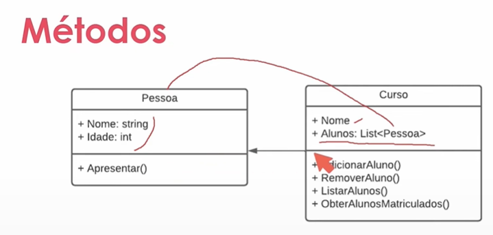

* Propriedades
  * É um membro que oferece um mecanismo flexível para ler, gravar ou calcular o valor de um campo particular.
  * props nome e idade abaixo
    * Pessoa
      * Nome: string
      * Idade: int
        * apresentar()
  * ```csharp
    private string _Nome;
            public string? Nome
            {
                get
                {
                    return _Nome.ToUpper();
                };
                set
                {
                    if (value == "")
                    {
                        throw new ArgumentException("O nome não pode ser vazio");
                    }
                    _Nome = value;
                };
            }
    ```

```csharp
private int myVar;

public int MyProperty

  {

    get { return myVar;}

    set{myVar=value;}

  }
```

`public int MyProperty { get; set; }`

Se tiver só get não da pra atribuir pelo código, se tiver só set não da pra ler pelo código

* Métodos
  * Bloco de código que contém uma série de instruções.
  * Métodos podem ser usados dentro de métodos
    * 
      * Alunos é uma lista de pessoas
* Construtores
  * Serve pra definir valores padrões de classes
