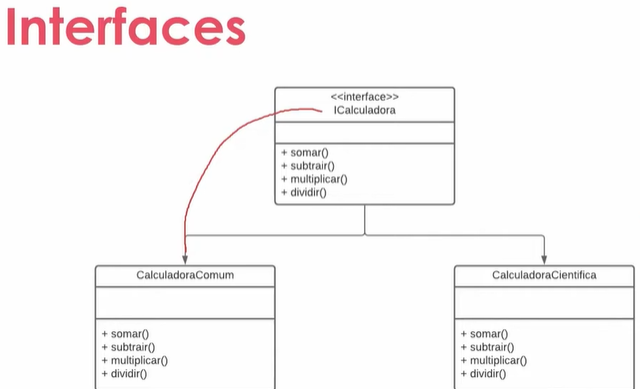
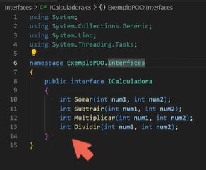
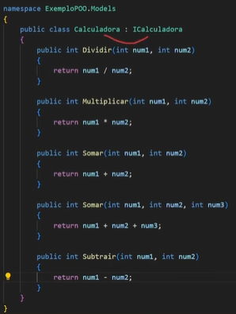
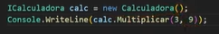
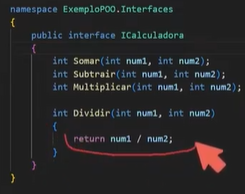

* **Classe abstrata:** Classe usada exclusivamente como modelo para ser herdada, não pode ser instanciada (não pode dar um new()))
* `<<abstract>>`
* Pois uma classe Conta é muito genérica, não faz sentido usar apenas Conta, então uma Conta pode ser herdada para uma Corrente : Conta, ou Poupança : Conta, Salario : Conta

* **Classe selada:** Classe que não pode ser herdada, com métodos e propriedades que também podem ser seladas. Pode-se herdar de uma outra classe que não seja selada e selar. Instância final de uma herança.
* `<<sealed>>`
* **Classe object:** Classe mãe de todas as Classes na hierarquia do .NET
* Todas classes derivam de Object. Ela provém serviços de baixo nível para as classes filhas:
  * Equals
  * GetHashCode
  * GetType
  * ToString
    * Todas classes são Class : Object.
* **Interfaces:** É como se fosse uma classe abstrata, não pode ser instanciada e é necessário herdá-la para ser utilizada
  * Por convenção, interfaces sempre começam com "I": ICalculadora
  * `<<interface>>`

* Acima, a interface ICalculadora é implementada em Calculadora Comum e Calculadora Científica. Nas implementações os métodos são obrigatóriamente redefinidos sobre a definição já existente da interface, com suas especificidades
* Interfaces ficam armazenadas no diretório > Interfaces
* Interface é como um contrato, oq tiver definido na interface e não tiver corpo deverá ser implementado na Classe que usa ela.
* Por padrão, as propriedades de uma interfaces são públicas:

* Abaixo, Calculadora implementa a interface ICalculadora:

* Também é possível definir métodos para interfaces:

* O método Dividir se tornou opcional, não é mais necessário implementá-lo pela classe que implementar a interface ICalculadora. Enquanto que Somar, Subtrair e Multiplicar devem ser obrigatóriamente implementados.
