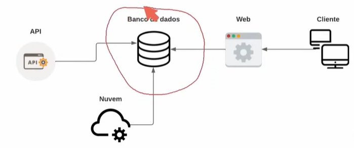
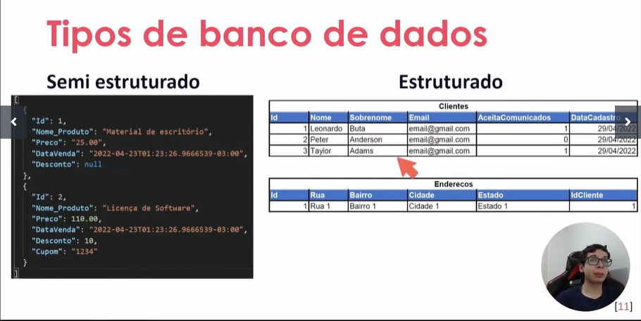

* obj: db para desenvolvimento
* db: coleção organizada de informações estruturadas armazenadas eletronicamente.
* 
* relacional: estruturados em tabelas com colunas e linhas que se relacionam
* não relacional: não estruturados em tabela, armazenados de maneira não estruturada ou semi-estruturada, sem regras rígidas como num relacional
* 
* Semi estruturado id 2 tem preço double enquanto id 1 está em string, cupom existe em id2 e não existe em id1
* DBMS: tipo o sql manager, serve pra acessar, manipular e monitorar o banco de dados
