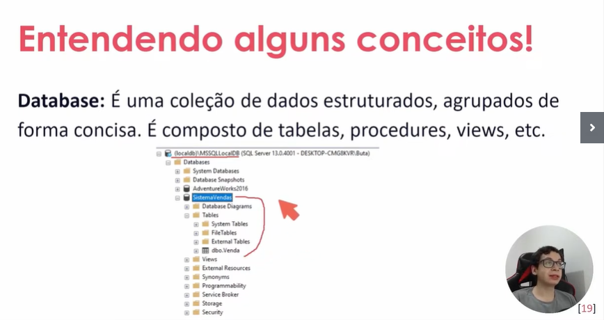
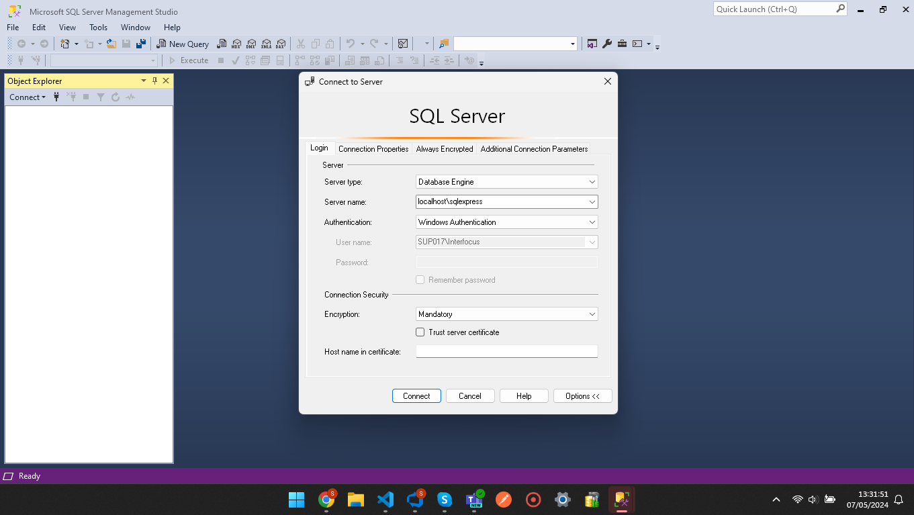
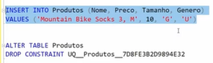

* sql structured query language, serve para consulta e manipulação de dados
  * DDL
    * CRETE
    * DROP
    * ALTER
    * TRUNCATE
  * DCL
    * GRANT
    * REVOKE
  * DML
    * INSERT
    * UPDATE
    * DELETE
  * TCL
    * COMMIT
    * ROLLBACK
    * SAVE POINT
  * DQL
    * SELECT

dropar constraint
