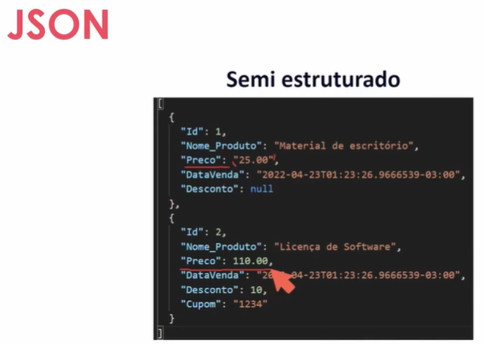

* mongodb
  * dados armazenados de maneira não estruturada ou semi-estruturada
  * semi-estruturado é tipo um json, por ser mais permissivo em como os valores são representados e quais valores são representados:
    * 
  * MongoDB Cloud -> Atlas
  * Cria um banco no site, cria um usuário pro banco, clica em connect, seleciona o compass, abre o compass, bota o link de acesso e pronto, conectado.
  * documento no mongodb é igual a json
