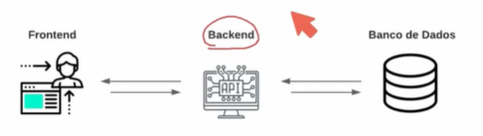

* Api e Entity Framework
  * Obj: aprender e desenvolver uma api usando entity framework para persistência de dados, juntamente com seus principais conceitos e funcionalidades
  * Entity Framework: Auxilia no armazenamento de dados em bancos de dados relacionais
* API: Aplication programming interface, forma de comunicação entre computadores ou programa de computadores. Software que fornece informação para outro software
  * Integração entre sistemas, serve para buscar e retornar informações em outro sistema


* exs:
  * https://date.nager.at
    * https://date.nager.at/api/v3/PublicHolidays/2024/BR
    * ```json
      {
          "date": "2024-01-01",
          "localName": "Confraternização Universal",
          "name": "New Year's Day",
          "countryCode": "BR",
          "fixed": false,
          "global": true,
          "counties": null,
          "launchYear": null,
          "types": [
            "Public"
          ]
        }
      ```
  * https://dog.ceo/dog-api


