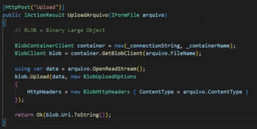
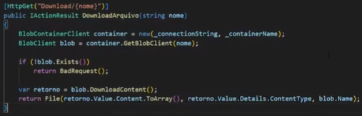
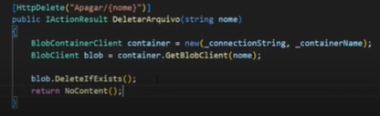
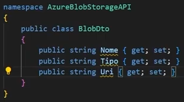
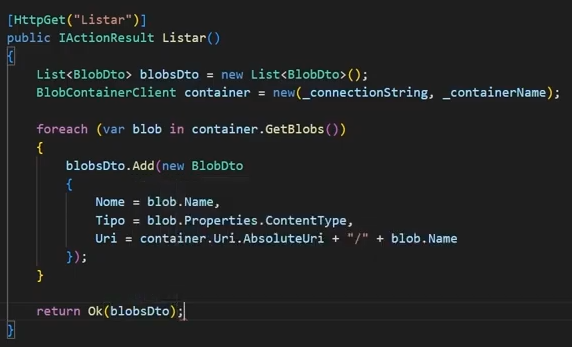

Configura e inicia uma VM no Azure, depois conecta e instala o IIS nessa VM com certificado RDP, daí é possível editar um html duma pastinha lá. Depois volta no Azure, vai em rede e adiciona regra de entrada com serviço http, protocólo tcp. Depois disso o html é acessável

um grupo de serviços com um serviço de banco e uma aplicação web .net windows, troca connection string com a string fornecida pela azure

instala azure tools no visual studio code, loga com a conta microsoft, faz deploy e boa

serverless: abstrair a preocupação com as configurações do servidor, memória, processamento.. nada, basta dizer windows ou linux, nem a versão do os precisa ser especificada (azure functions são serverless [não curti, prefiro ficar nos meus controllers, services, mappings.. mas legal saber que existe]), bom que é MUITO BARATO no azure, deploy facinho com a extensão da azure no vscode

BLOB = Binary Large Object

azure blob storage: guardar imagens, vídeos, áudios, logs, backups e etc..

* criar um recurso de "Contas de Armazenamento", bom ser em outro grupo de recursos
* cria um novo contêiner dentro do recurso, com nome "imagens", por exemplo

depois consegue criar uma webapi qualquer com o aspnet e criar um endpoint pra fazer upload da foto no contêiner, com um "BlobConnectionString", provido pela Azure e "BlobContainerName" com o nome do contêiner (imagens, no caso)

instala o pacote Azure.Storage.Blobs no projeto da webapi e segue a sintaxe da biblioteca dos blobs da azure, muito parecido com o que fiz na vendinha, mas diferente, no fim faz a mesma coisa, mas salva num blob de um recurso da azure ao invés de salvar naquele wwwroot..

pra fazer download é muito parecido com o upload, mais simples, maneiro

pra deletar é mais simples ainda, maneiro

retornar lista de blobs com um BlobDTO, uma entidade com as propriedades que serão usadas na listagem de blobs

mas da maneira que está sendo feita acima não faz sentido pois arquivos com nomes iguais causariam diversos problemas. A biblioteca do blob da azure facilita bastante

Azure Tables, dentro de um recurso de "Conta de Armazenamento"

* armazena dados de maneira NoSQL